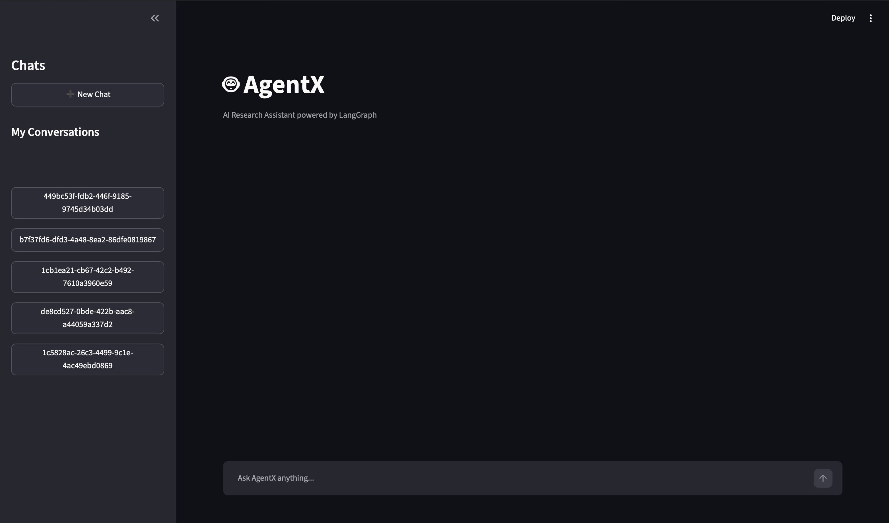
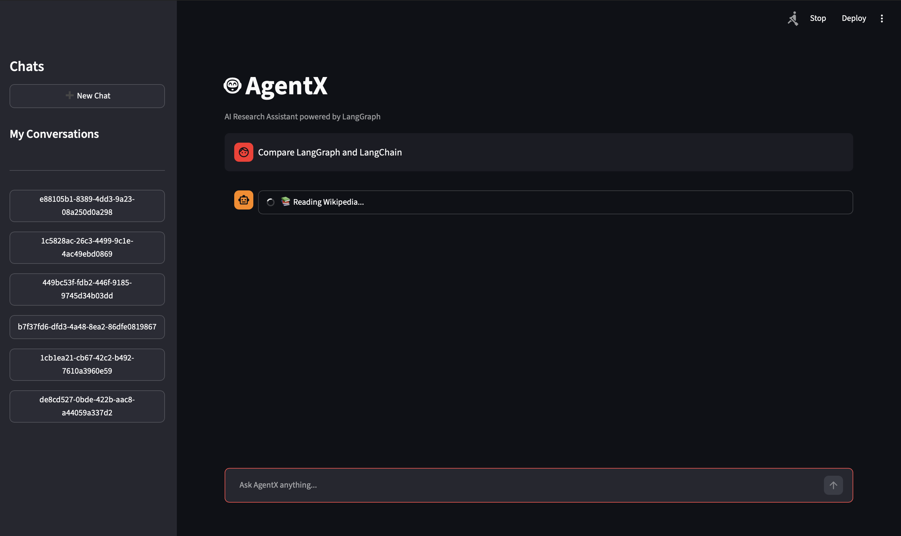
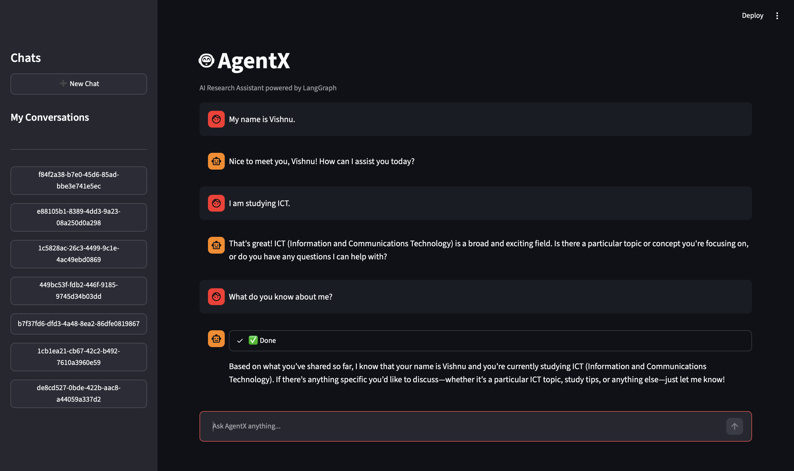

# 🤖 AgentX

AgentX is an AI-powered research assistant built using **LangGraph**, **LangChain**, and **Streamlit**. It intelligently decides when to use external tools such as **DuckDuckGo Search**, **Wikipedia**, and a **Current Date** utility to answer user queries.

The project demonstrates the fundamentals of **Agentic AI**, including tool calling, memory, streaming, and multi-turn conversations.

---

## ✨ Features

- 🤖 Agentic AI workflow using LangGraph
- 🔄 Intelligent tool calling with ToolNode
- 🔍 Real-time web search using DuckDuckGo
- 📚 Wikipedia integration
- 📅 Current date utility
- 🧠 Persistent memory using SQLite Checkpointer
- 💬 Multiple conversation threads
- 📌 Thread-based chat history
- 📊 Live tool status updates
- 🎨 Interactive Streamlit UI

---

## 🛠️ Tech Stack

| Category | Technology |
|----------|------------|
| Frontend | Streamlit |
| Agent Framework | LangGraph |
| LLM | openai/gpt-oss-120b (via Groq) |
| LLM Framework | LangChain |
| Memory | SQLite + LangGraph Checkpointer |
| Search | DuckDuckGo Search |
| Knowledge Base | Wikipedia |
| Language | Python |

---

## 📋 Requirements

- Python 3.11+
- Groq API Key
- Git

## 📁 Project Structure

```text
AgentX/
│
├── app.py                # Streamlit UI
├── graph.py              # LangGraph workflow
├── tools.py              # Agent tools
├── requirements.txt
├── .env.example
├── README.md
├── .gitignore
└── agent_memory.db       # Generated automatically
```

---

## 🚀 Installation

### Clone the repository

```bash
git clone https://github.com/vishnu-g4947/AgentX.git

cd AgentX
```

### Create Virtual Environment

```bash
python -m venv venv
```

### Activate the Virtual Environment

**macOS / Linux**

```bash
source venv/bin/activate
```

**Windows**

```bash
venv\Scripts\activate
```

### Install Dependencies

```bash
pip install -r requirements.txt
```

---

## 🔑 Environment Variables

Create a `.env` file.

```env
GROQ_API_KEY=your_groq_api_key
```

---

## ▶️ Run the Application

```bash
streamlit run app.py
```

---

## 💡 Example Questions

- Latest ISRO news
- Who is Alan Turing?
- Explain Retrieval-Augmented Generation.
- What is today's date?
- Tell me about LangGraph.
- Compare Python and Java.
- What happened in the latest AI news?

---

## 🧠 How It Works

1. User enters a query.
2. LangGraph decides whether a tool is required.
3. If needed, the agent calls:
   - DuckDuckGo Search
   - Wikipedia
   - Current Date Tool
4. Tool output is returned to the LLM.
5. The LLM generates the final response.
6. The conversation is stored in SQLite for future chats.

---

## 📸 Screenshots

### Home Page



---

### Tool Calling



---

### Conversation Memory



---

## 🚀 Future Improvements

- Streaming token-by-token responses
- Source citations
- File upload support
- PDF Question Answering
- Image Understanding
- Multi-agent workflow
- Voice input/output
- Authentication
- Dark/Light themes

---

## 📚 Learning Outcomes

This project helped me learn:

- LangGraph fundamentals
- Agentic AI workflows
- Tool calling
- State management
- Conversation memory
- SQLite checkpointing
- Streamlit application development
- LangChain integration
- LLM orchestration

---

## 🙏 Acknowledgements

This project was built as part of the **MSTC GenAI Track 2026** to explore Agentic AI using LangGraph and Streamlit.

---

## 📄 License

This project is licensed under the MIT License.